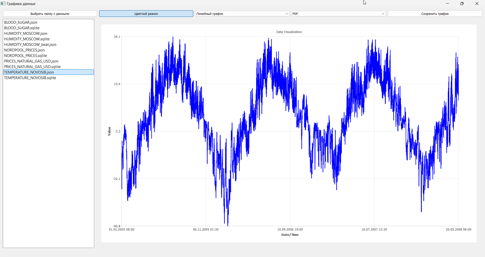

# TSU_STD_PrintGraphs

## Кратко
Приложение на Qt Widgets для визуализации временных рядов (JSON/SQLite), переключения видов графиков (линия/область/точки) и экспорта результата в PDF или JPEG. Вся конфигурация строится на IoC‑контейнере, поэтому новые источники данных, рендереры или экспортеры подключаются без изменений UI.

## Архитектура
- `MainWindow` – слой представления, отвечает за UI и пользовательские сценарии.
- `IGraphRenderer` + `BaseGraphRenderer` и наследники – слой визуализации.
- `IDataSource` + реализации для JSON/SQLite – слой доступа к данным.
- `IExporter` + Pdf/Jpeg – слой экспорта.
- `IOCContainer` + `setupIoC` – регистрируют зависимости и выдают нужные объекты по ключам.

## Применяемые паттерны
- **Inversion of Control / Dependency Injection** – глобальный `IOCContainer` управляет жизненным циклом компонентов; `MainWindow` просит нужный интерфейс по ключу.
- **Factory** – `RegisterFactory` создает объекты на лету; разные ключи (`"line"`, `"area"`, `"scatter"`...) выбирают конкретную реализацию.
- **Strategy** – источники данных, рендереры и экспортеры взаимозаменяемы, выбор стратегии определяется расширением файла или настройкой пользователя.
- **Template Method** – `BaseGraphRenderer::render()` определяет общий алгоритм (очистка, настройка осей), а наследники переопределяют шаги `setupSeries()` и `updateSeriesStyle()`.

## Функциональные возможности
- выбор каталога с исходниками (`InputData`) и автоматическое перечисление JSON/SQLite;
- быстрая смена типа графика с сохранением текущих данных;
- переключение цветного/монохромного стиля;
- загрузка и валидация временных рядов (парсинг строковых дат и «минут от начала дня»);
- экспорт текущего графика в PDF или JPEG с предпросмотром имени файла.

## Логика работы
1. При старте `main.cpp` вызывает `setupIoC()`, затем открывает `MainWindow`.
2. Пользователь выбирает каталог → список файлов фильтруется по поддерживаемым расширениям.
3. Двойной клик по файлу:
   - расширение определяет ключ для `IDataSource`;
   - источник загружает массив пар время‑значение и конвертирует в `QPointF` (ось X в миллисекундах UTC);
   - активный `IGraphRenderer` визуализирует данные, кнопка экспорта становится доступной.
4. Смена типа графика/цвета создаёт новый рендерер (через IoC) и переотрисовывает кешированные данные.
5. Нажатие «Сохранить...»:
   - формат определяется текущим пунктом `QComboBox`;
   - `IExporter` рендерит `QChartView` в PDF или JPEG.

## Как расширять
- Добавить новый формат данных: реализовать `IDataSource`, зарегистрировать в `setupIoC()` с ключом, совпадающим с расширением.
- Добавить новый тип графика: реализовать наследника `BaseGraphRenderer`, зарегистрировать и добавить пункт в комбобокс.
- Добавить новый экспорт: реализовать `IExporter`, зарегистрировать, расширить `QComboBox`.

